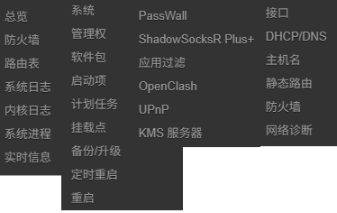

  
# 基于lede源码编译的OpenWrt x86_64固件纯净版

每天凌晨3点自动编译

### 功能预览：

 
### 固件说明

采用[LEDE](https://github.com/coolsnowwolf/lede)源码编译，固件功能如上图所示：

- 插件列表
   - 定时重启
   - KMS服务器
   - 应用过滤
   - ShadowsocksR Plus+
   - passwall
   - openclash
   - upnp

- 下载链接
[https://github.com/ganan3917/OpenWrt/releases](https://github.com/ganan3917/OpenWrt/releases)
